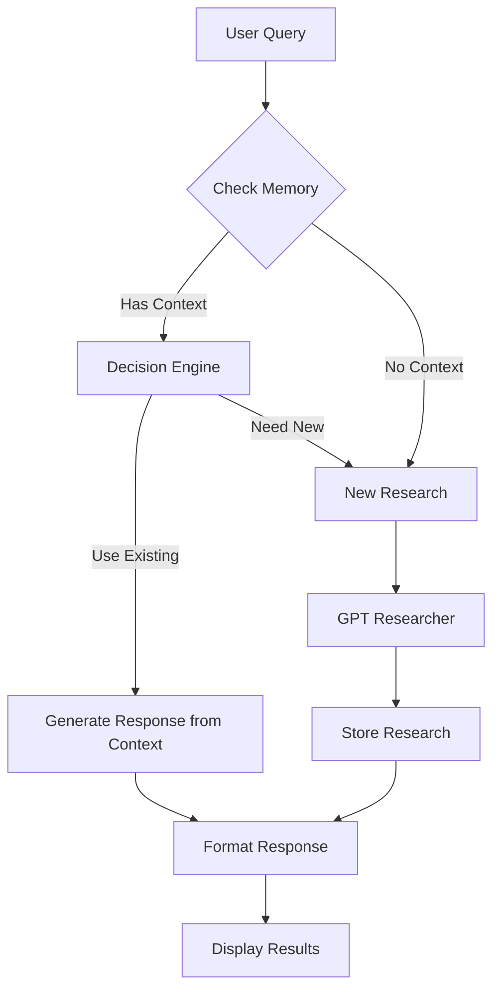

<div align="center">

# Research Chatbot

**An intelligent conversational agent that combines GPT Researcher with memory management and context-aware responses for efficient and accurate research interactions.**

</div>

## Why Research Chatbot?

- **Smart Context Reuse**: Avoids redundant research by intelligently reusing relevant previous findings

- **Memory Management**: Maintains conversation history and research context for more relevant responses

- **Structured Output**: Uses Pydantic models for reliable and type-safe data handling

- **Rich Console Output**: Beautiful console interface with markdown support and progress indicators

- **Cost Efficient**: Minimizes API costs by reusing existing research when appropriate

## System Flow



1\. **Query Input**: User submits a research question

2\. **Memory Check**: System checks for existing relevant research

3\. **Decision Making**: LLM evaluates if existing research is sufficient

4\. **Research Process**: Either uses existing context or conducts new research

5\. **Response Generation**: Creates comprehensive response with citations

6\. **Results Display**: Shows formatted response with statistics

## Features

- 📚 Smart context reuse with LLM-powered decision making

- 🧠 Efficient memory management with configurable context limits

- 📊 Research statistics tracking (costs, sources, images)

- 💅 Rich console interface with markdown formatting

- ⚡ Asynchronous operations for better performance

- 🔍 Seamless integration with GPT Researcher

## Installation

1\. Clone the repository:

```bash

git clone [https://github.com/rupeshksingh/RESEARCH_BOT.git]

cd research-chatbot

```

2\. Install required packages:

```bash

pip install gpt-researcher langchain-openai pydantic python-dotenv rich nest-asyncio

```

3\. Create a `.env` file with your OpenAI API key:

```bash

OPENAI_API_KEY=your-api-key-here
JINA_API_KEY=api-key-here
TAVILY_API_KEY=api-key-here
```

## Usage

### Basic Usage

```python

from research_chatbot import ResearchChatbot

import asyncio

import nest_asyncio

async def main():

    # Initialize the chatbot

    chatbot = ResearchChatbot()

    # Ask a research question

    response = await chatbot.chat("What are the latest developments in quantum computing?")

    print(response)

if __name__ == "__main__":

    nest_asyncio.apply()

    asyncio.run(main())

```

### Interactive Console

The chatbot comes with a rich interactive console interface:

```python

if __name__ == "__main__":

    nest_asyncio.apply()

    asyncio.run(main())

```

This will start an interactive session where you can:

- Type your research questions

- See beautiful formatted responses

- View research statistics

- Type 'exit' to end the session

## Core Components

### ResearchContext

```python

class ResearchContext(BaseModel):

    query: str

    timestamp: datetime

    report: str

    sources: List[dict]

    costs: float

    images: List[str]

```

### QueryDecision

```python

class QueryDecision(BaseModel):

    use_existing_context: bool

    reasoning: str

    relevant_context_indices: List[int] = []

```

### ChatMemory

Manages research context with a configurable memory limit:

```python

class ChatMemory:

    def __init__(self, max_contexts: int = 10):

        self.contexts: List[ResearchContext] = []

        self.max_contexts = max_contexts

```

## Console Output Examples

The chatbot provides rich console output with:

- 💭 Thinking indicators

- 📚 Context usage notifications

- 🔍 Research status updates

- 📊 Research statistics

- Markdown-formatted responses

## Configuration

You can customize the chatbot by modifying:

- `max_contexts` in ChatMemory

- LLM model in ResearchChatbot initialization

- GPT Researcher settings via config.json

## Dependencies

- gpt-researcher

- langchain-openai

- pydantic

- python-dotenv

- rich

- nest-asyncio

## Contributing

Contributions are welcome! Please feel free to submit a Pull Request.

## License

This project is licensed under the MIT License - see the [LICENSE](LICENSE) file for details.

## Acknowledgments

- Built on top of [GPT Researcher](https://github.com/assafelovic/gpt-researcher)

- Uses OpenAI's GPT-4 for decision making

- Rich console interface powered by [rich](https://github.com/Textualize/rich)
